# 🐝 Bee Haven: an end-to-end Azure data pipeline for beehive sensor data

An automated **Medallion Lakehouse** (Bronze → Silver → Gold) on Microsoft Azure that cleans 2.5 years of beehive sensor data,
enriches it with historical weather from the **BrightSky API**, and delivers analysis-ready tables, orchestrated nightly by **Azure Data Factory**
and processed in **Azure Synapse** notebooks.

**Business question:** *What makes bees busy?* How do temperature, sunshine and rain influence bee traffic and honey production?

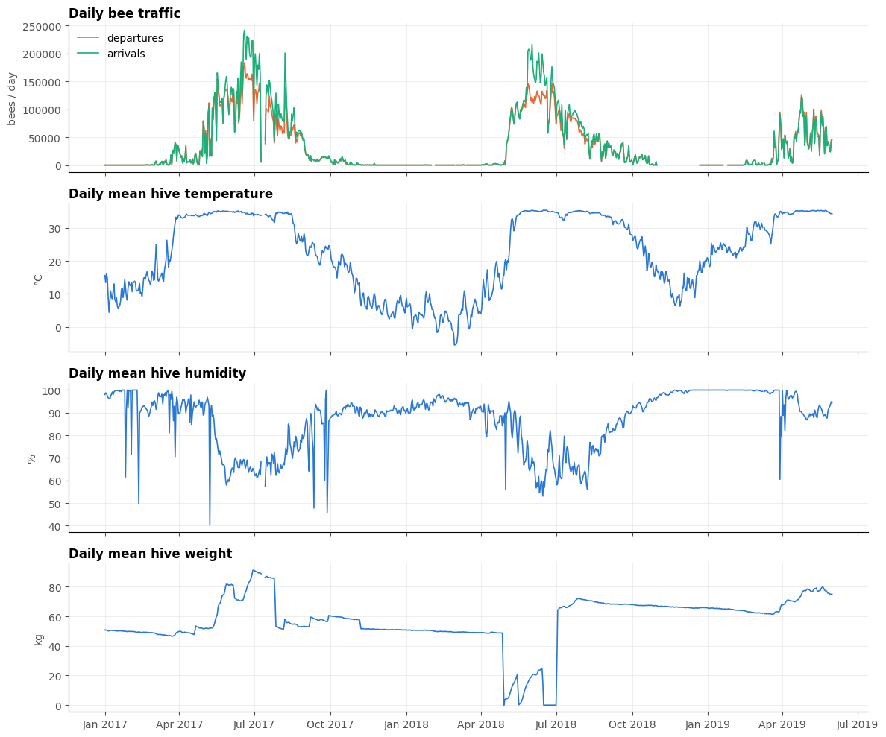

---

## Architecture

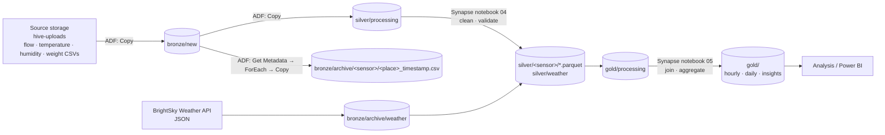

**Orchestration (Azure Data Factory), 14 activity runs, all succeeded:**
`Copy` source → bronze/new → `Get Metadata` → `ForEach` (archive each file with a timestamp) → `Copy` to silver/processing
→ **Synapse Notebook 04** → `Delete` silver/processing → **Synapse Notebook 05** → `Delete` gold/processing.
A daily **schedule trigger** runs the whole chain. If a notebook's quality checks fail, the run stops and the files stay in the processing folder for inspection.

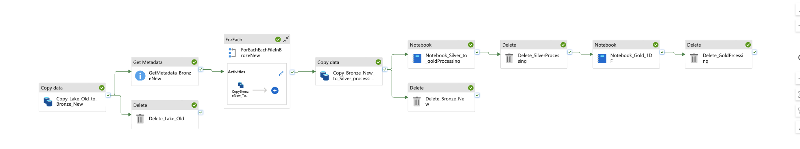

## Running in Azure

| | |
|---|---|
| **Pipeline run: all activities succeeded** 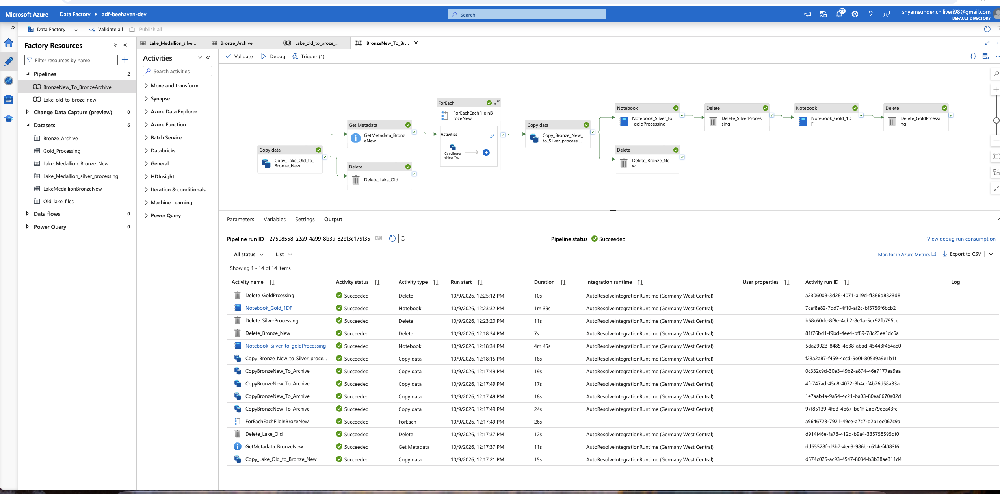 | **Resources (rg-beehaven-dev, Germany West Central)** 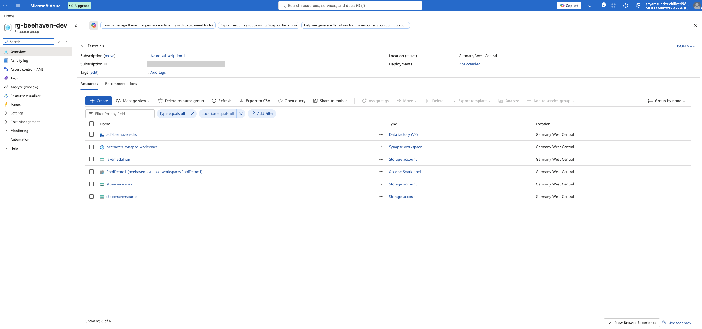 |
| **Data Lake: medallion folders** 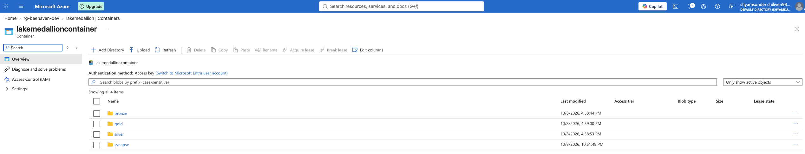 | **Gold tables computed in Synapse** 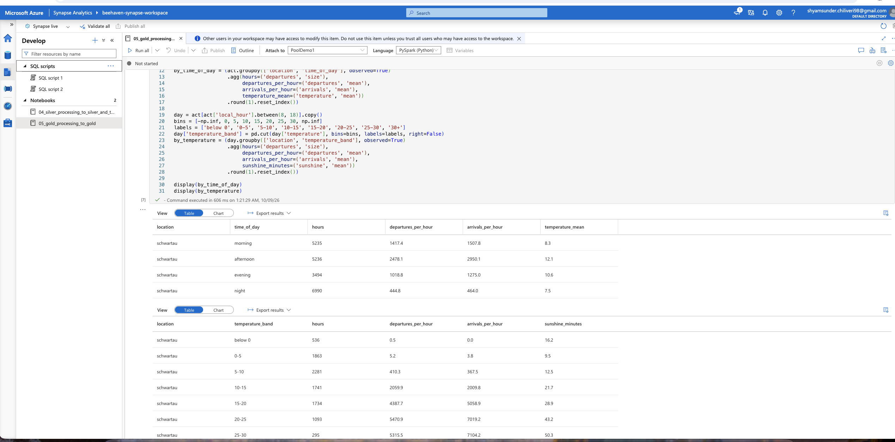 |
| **RBAC: Data Factory's managed identity as Synapse Administrator** 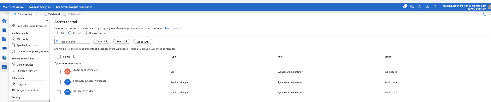 | **Daily schedule trigger** 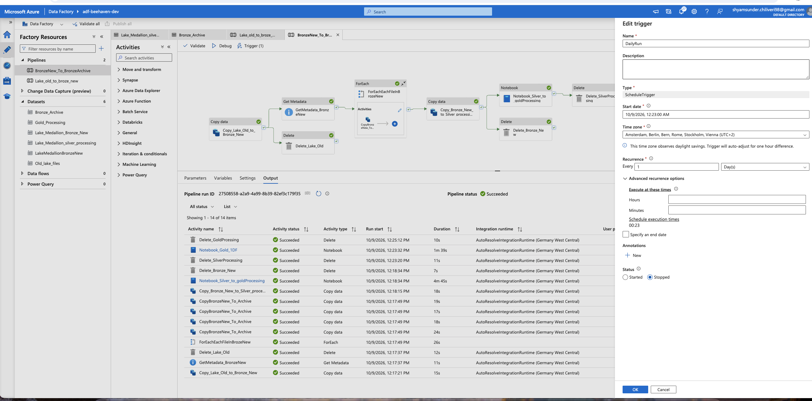 |

The full Data Factory definition (pipelines, datasets, linked services and trigger, exported as an ARM template) is in
[`azure-data-factory/`](azure-data-factory/), including an activity-by-activity description.

## Tech stack

| Area | Tools |
|---|---|
| Storage | Azure Data Lake Storage Gen2 (hierarchical namespace, medallion folders) |
| Orchestration | Azure Data Factory: Get Metadata, ForEach, Copy, Notebook, Delete, schedule trigger, dynamic content |
| Processing | Azure Synapse Analytics: Apache Spark pool running Python notebooks |
| Language and libraries | Python, pandas, NumPy, fsspec / adlfs, requests, matplotlib |
| File formats | CSV (raw), JSON (API, semi-structured), **Parquet** (columnar, silver and gold) |
| Security | Azure RBAC / IAM: managed identity for Data Factory, Synapse RBAC roles |
| Infrastructure as code | ARM template export of the whole Data Factory |

## The data

| Source | Frequency | Size | Notes |
|---|---|---|---|
| Bee flow (departures / arrivals) | 1 min | 2.5M rows | Two series stacked in one file |
| Hive temperature | 5 min | 253k rows | |
| Hive humidity | 12 h | 1.8k rows | |
| Hive weight | 12 h | 1.8k rows | grams |
| Weather (BrightSky / DWD) | 1 h | 21k rows | Temperature, rain, sunshine, wind, cloud cover … |

Period: January 2017 to May 2019, hive in Bad Schwartau, Germany.

## Data-quality issues found and how they were solved

Every decision is backed by a chart in `notebooks/01_bronze_to_silver_local.ipynb`.

| Issue found | Decision | Why |
|---|---|---|
| Timestamps stored as text, in German local time | Converted to **UTC** | Daylight saving makes 02:00–02:59 happen twice in October; UTC gives every moment one timestamp and matches the weather API |
| Flow file = departures stacked on top of arrivals | Split into `flow_out` / `flow_in` | One timestamp, one row, clear meaning |
| 697k "duplicate" rows in raw flow | **Kept** | They are real zero counts (night) appearing once in each half; dropping them would delete data |
| Humidity of −100 % next to 100 % | Absolute value | Sign-flip sensor error |
| Weight of −170 g after the hive was emptied | Clipped to 0 | A scale can't weigh less than nothing |
| Arrivals of 7,999 bees/min, and spikes at night | Set to NaN | Error code; more arrivals than the busiest departure minute ever is physically impossible |
| IQR / z-score outlier rules | Tested, **not used** | Bee traffic is extremely skewed; they would flag ~175k normal busy minutes |
| Missing values and sensor outages | Kept as NaN | Silver doesn't invent data; filling gaps is an analysis decision |
| Weather values borrowed from more distant stations (`fallback_source_ids`) | `<measure>_source_distance` columns | Analysts can see how far away each value was measured |

<p float="left">
  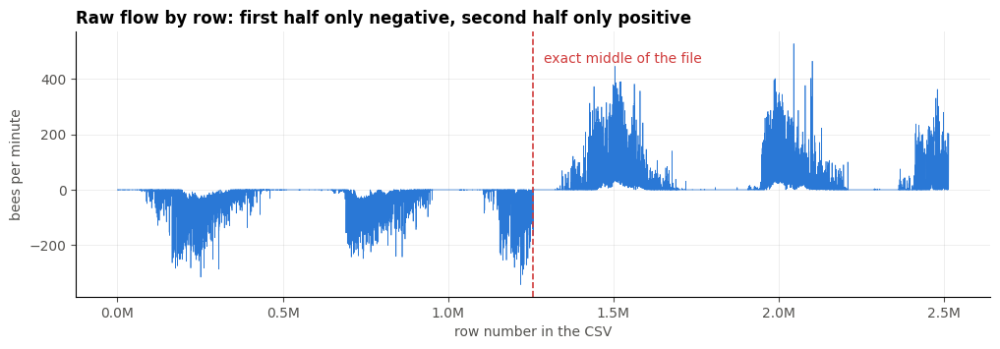
  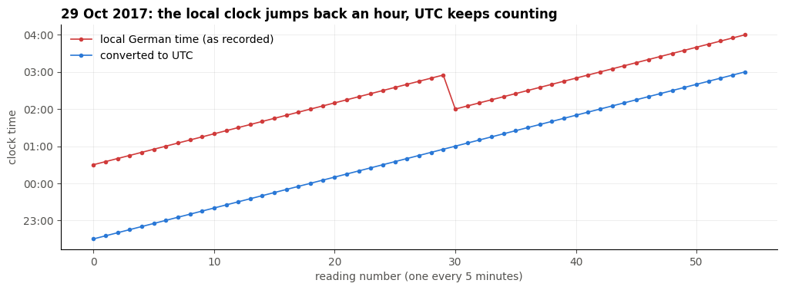
</p>
<p float="left">
  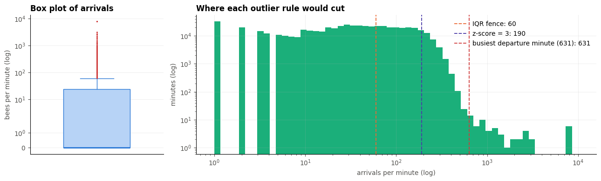
  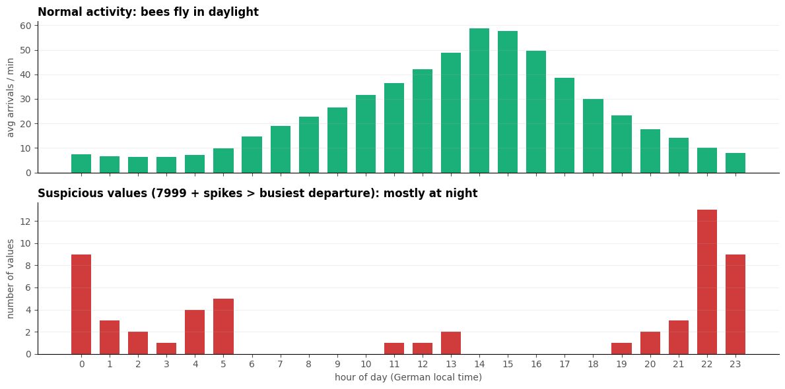
</p>

## Gold layer: analysis-ready tables

| Table | Grain | Content |
|---|---|---|
| `hivedata_hourly` ★ | 1 row per hour per hive | Departures, arrivals, hive temperature/humidity/weight + all weather measures, aligned on UTC hour |
| `hivedata_daily` | 1 row per day | Daily totals (bees, rain, sunshine hours) and averages, plus **daily weight change** |
| `activity_by_time_of_day` | morning / afternoon / evening / night | Average bees per hour |
| `activity_by_temperature` | 5 °C outside-temperature bands | Daytime bees per hour |

Why **hourly**: the sensors tick at different rates (1 min, 5 min, 12 h) and weather is hourly. Joining on exact timestamps leaves
most cells empty, so aggregating to hours gives every row its matching weather. Counts are **summed**, measurements **averaged**.

## First insights

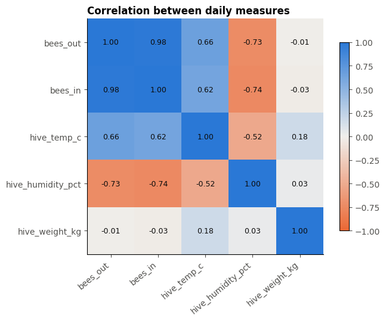

- Bee traffic rises steeply once the hive is above ~20 °C (correlation +0.66 with hive temperature).
- The hive gets **drier on busy days** (−0.74), likely because bees fan their wings to dry nectar into honey.
- Weight is a running total, so the **daily change** in weight, not its level, is what relates to activity.
- The colony keeps the brood nest at ~35 °C all summer, regardless of the weather outside.

## Repository structure

```
├── notebooks/
│   ├── 01_bronze_to_silver_local.ipynb        # exploration + cleaning decisions, with charts
│   ├── 02_weather_api_to_silver.ipynb         # BrightSky API → bronze JSON → silver Parquet
│   ├── 04_silver_processing_to_silver_and_to_gold_processing.ipynb   # pipeline notebook (Synapse)
│   └── 05_gold_processing_to_gold.ipynb       # pipeline notebook (Synapse): gold tables
├── azure-data-factory/
│   ├── pipeline_BronzeNew_To_BronzeArchive.json   # main pipeline
│   ├── pipeline_Lake_old_to_broze_new.json
│   ├── trigger_DailyRun.json
│   └── arm-template/                              # full ARM export of the factory (no secrets)
├── images/                                    # charts + images/azure/ screenshots
├── requirements.txt
└── README.md
```

## How to run locally

```bash
pip install -r requirements.txt
```

Use this folder layout. The raw data is not included in this repository.

```
project/
├── bronze/new/          # flow_schwartau.csv, humidity_schwartau.csv, temperature_schwartau.csv, weight_schwartau.csv
└── notebooks/           # the notebooks from this repo
```

Run `01` → `02` (exploration), or `04` → `05` (pipeline version). The pipeline notebooks detect automatically whether they run
locally or in Synapse. In Synapse, fill in the storage account and container in the Settings cell and read the key from
**Azure Key Vault**. No credentials are stored in this repository.

## What I learned

- Designing a **Medallion Lakehouse** and why each layer exists (raw safety net → trusted facts → analysis-ready answers)
- Building **parameterised, dynamic pipelines** in Azure Data Factory, with success/failure paths and triggers
- Working with **semi-structured JSON** from a REST API and flattening nested fields
- Time-zone handling (DST) and why **UTC** is essential when joining sources
- Why **Parquet** (columnar, compressed, typed) beats CSV for analytics
- **RBAC / managed identities**: giving Data Factory exactly the Synapse role it needs
- Choosing data-cleaning rules from domain knowledge instead of applying textbook outlier rules blindly

Built as part of the Data Science & AI programme at WBS Coding School, aligned with the **Microsoft DP-900 (Azure Data Fundamentals)** certification.

---
*Author: Shyam Sunder Chiliveri*
